<h1 align="center">Stroke Prediction Using Machine Learning</h1>

<p align="center">
  
  
  
  
</p>

<p align="center">
  End-to-end healthcare machine learning pipeline for predicting stroke risk using patient health records and explainable AI.
</p>

---

<p align="center">
  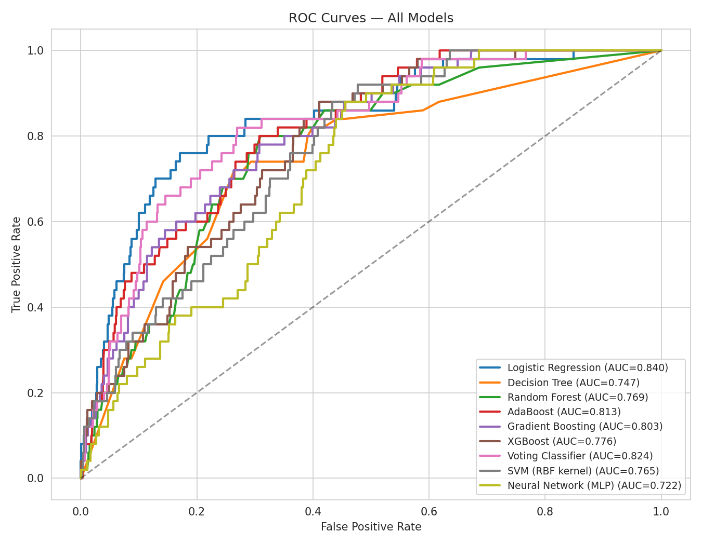
</p>

# Stroke Prediction Using Machine Learning

A complete end-to-end Machine Learning project for predicting stroke risk using healthcare patient data.  
This project compares multiple classification models, evaluates performance using medical-focused metrics, and explains predictions using SHAP interpretability techniques.

---

## Project Overview

Stroke is one of the leading causes of death and long-term disability worldwide.  
Early prediction of stroke risk can help healthcare providers make faster and more accurate decisions.

This project uses a real-world healthcare dataset to:

- preprocess and clean patient data
- handle severe class imbalance using SMOTE
- train and compare multiple machine learning models
- evaluate model performance using ROC-AUC, Recall, F1-score, and calibration
- interpret predictions using SHAP explainability

---

## Dataset

Dataset Source:

https://www.kaggle.com/datasets/fedesoriano/stroke-prediction-dataset

### Dataset Information

- Total records: 5,110 patients
- Target variable: `stroke`
- Binary classification problem
- Severe class imbalance (~4.87% stroke cases)

### Features

- age
- gender
- hypertension
- heart_disease
- avg_glucose_level
- bmi
- smoking_status
- work_type
- Residence_type
- ever_married


---

# Machine Learning Workflow

The project follows a full preprocessing and modeling pipeline.

## Pipeline Steps

1. Data loading
2. Data cleaning
3. Missing value handling
4. Feature engineering
5. Encoding categorical variables
6. Feature scaling
7. Train-test split
8. SMOTE oversampling
9. Model training
10. Performance evaluation
11. SHAP explainability

---

# Preprocessing Pipeline

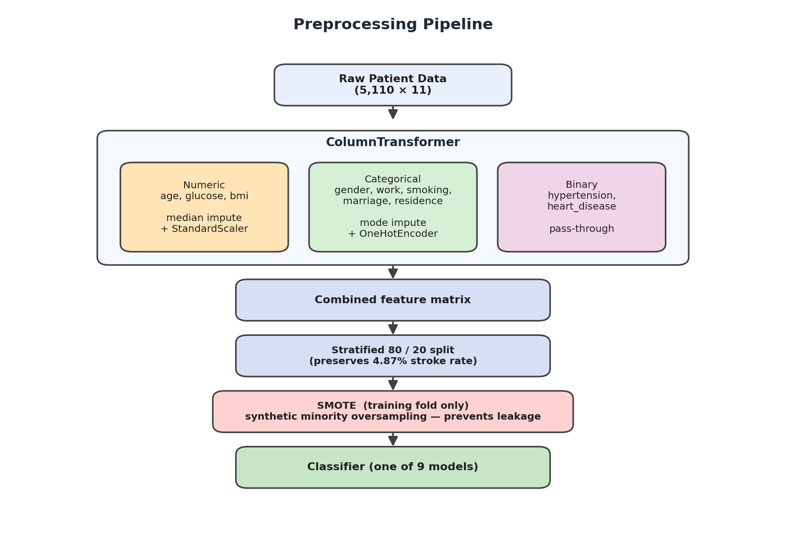

### Numeric Features
- median imputation
- StandardScaler normalization

### Categorical Features
- mode imputation
- OneHotEncoder

### Binary Features
- passed directly into the model

### Class Imbalance Handling
SMOTE was applied only to the training fold to prevent data leakage.

---

# Models Compared

The following models were trained and evaluated:

| Model |
|---|
| Logistic Regression |
| Decision Tree |
| Random Forest |
| AdaBoost |
| Gradient Boosting |
| XGBoost |
| Voting Classifier |
| SVM (RBF Kernel) |
| Neural Network (MLP) |

---

# Dataset Imbalance Analysis

<p align="center">
  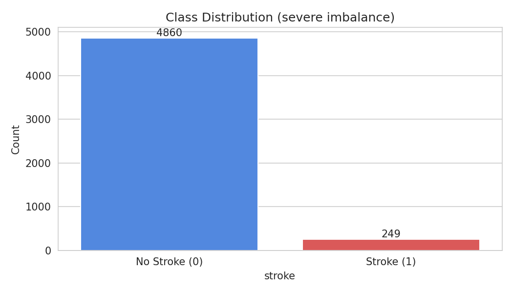
</p>

The dataset contains severe class imbalance, which makes stroke prediction challenging in real-world healthcare environments.

The dataset contains severe class imbalance.

- Non-stroke: 4860
- Stroke: 249

This imbalance makes Recall and ROC-AUC more important than Accuracy alone.

---

# Model Performance

## ROC Curve Comparison

<p align="center">
  
</p>

The ROC curve comparison shows the classification performance of all machine learning models.

### ROC-AUC Results

| Model | ROC-AUC |
|---|---|
| Logistic Regression | 0.840 |
| Voting Classifier | 0.824 |
| AdaBoost | 0.813 |
| Gradient Boosting | 0.803 |
| XGBoost | 0.776 |
| Random Forest | 0.769 |
| SVM | 0.765 |
| Decision Tree | 0.747 |
| Neural Network (MLP) | 0.722 |

---

# Best Performing Model

## Logistic Regression

The Logistic Regression model achieved the best overall balance between:

- ROC-AUC
- Recall
- Stability
- Interpretability

### Key Results

| Metric | Score |
|---|---|
| ROC-AUC | 0.840 |
| Recall | 0.800 |
| Accuracy | 0.736 |

This makes Logistic Regression the most suitable model for healthcare screening tasks where detecting stroke cases is more important than maximizing overall accuracy.

---

# Confusion Matrix Analysis

<p align="center">
  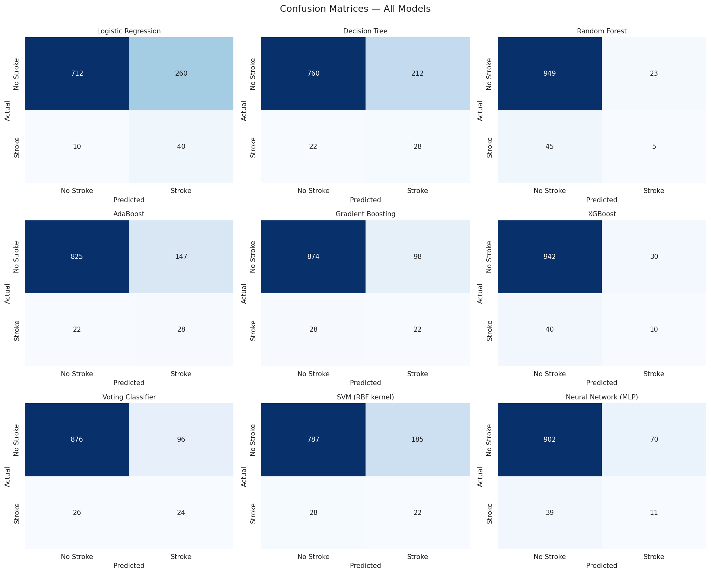
</p>

The confusion matrices show how each model performs in identifying stroke and non-stroke patients.

Logistic Regression achieved the highest recall and successfully detected more stroke cases compared to other models.

---

# Cross-Validation Stability Analysis

<p align="center">
  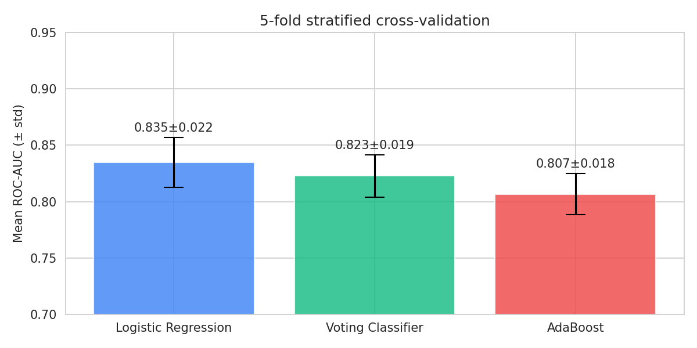
</p>


5-fold stratified cross-validation was used to test model stability.

### Mean ROC-AUC Scores

| Model | Mean ROC-AUC |
|---|---|
| Logistic Regression | 0.835 ± 0.022 |
| Voting Classifier | 0.823 ± 0.019 |
| AdaBoost | 0.807 ± 0.018 |

The results show that Logistic Regression remained stable across multiple validation folds.

---

## Feature Importance Analysis

<p align="center">
  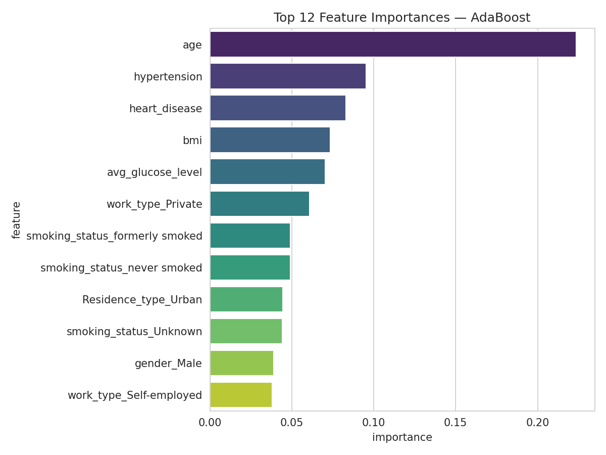
</p>

The most important features for stroke prediction were:

1. age
2. hypertension
3. heart_disease
4. bmi
5. avg_glucose_level

Age was the strongest predictor across multiple models.

---

# SHAP Explainability

## SHAP Summary Plot

<p align="center">
  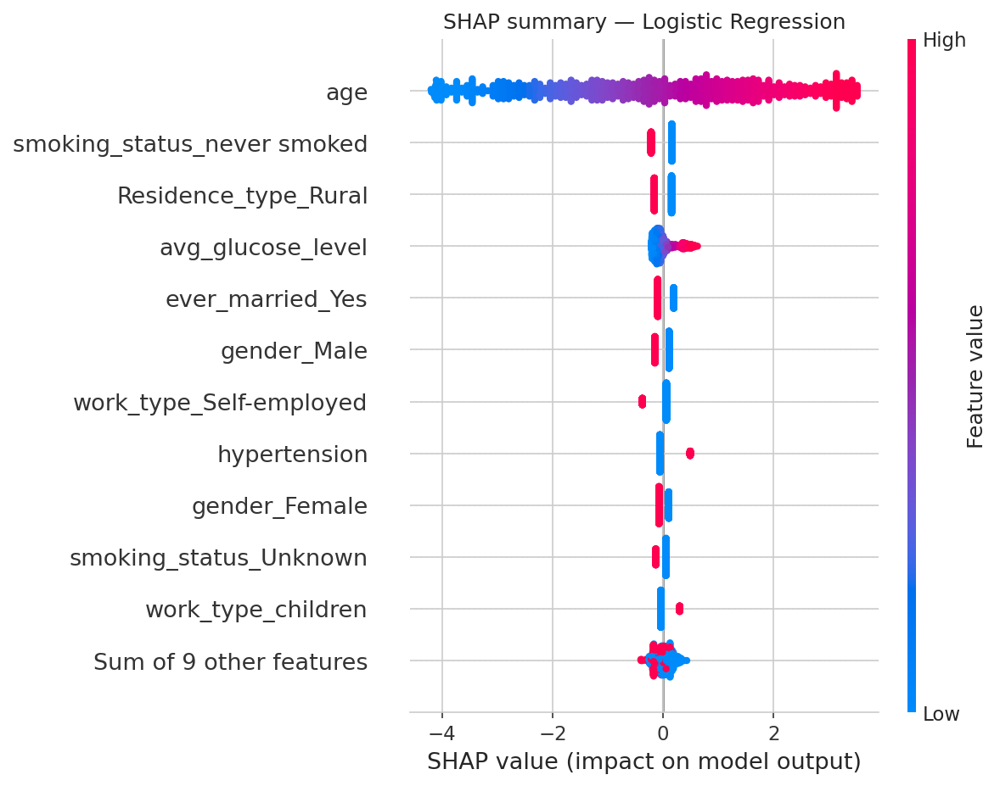
</p>

SHAP values were used to explain how features influence model predictions.

### Main Findings

- higher age strongly increased stroke risk
- high glucose levels increased risk
- hypertension contributed positively to prediction
- smoking-related features also affected risk

---

## SHAP Waterfall Example

<p align="center">
  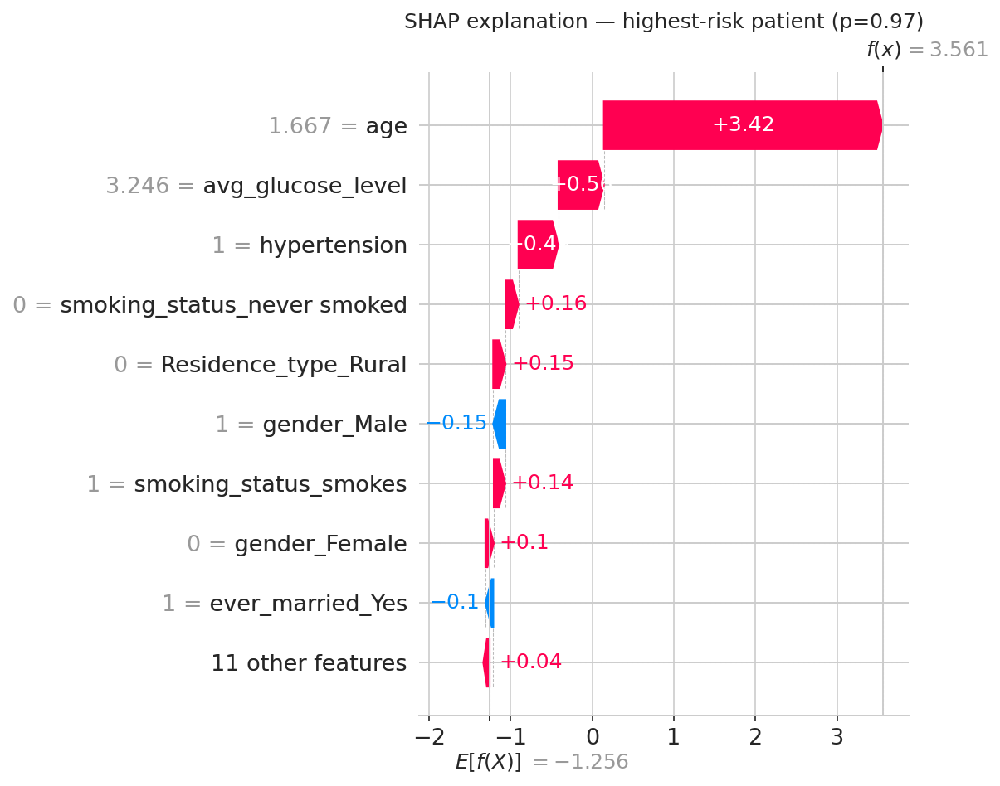
</p>


This visualization explains why the model predicted high stroke probability for a specific patient.

---

# Decision Threshold Optimization

<p align="center">
  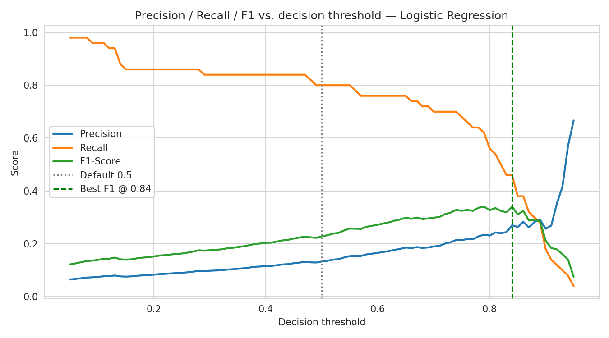
</p>

## Threshold Tuning


Threshold optimization was performed to balance:

- Precision
- Recall
- F1-score

This is important in healthcare applications where missing stroke cases can have serious consequences.

---

# Probability Calibration Analysis

<p align="center">
  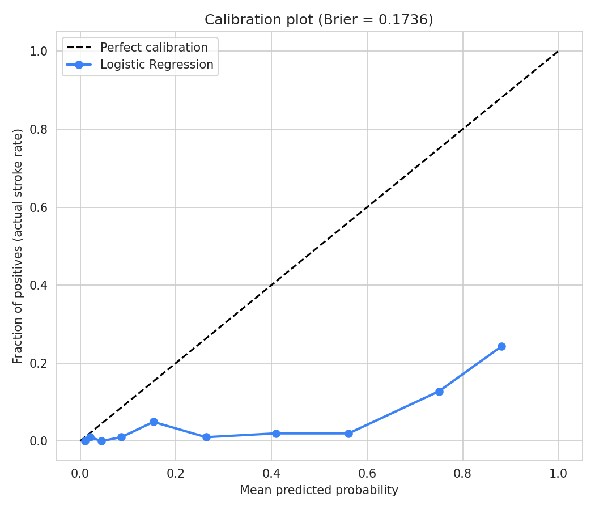
</p>

Calibration analysis was used to evaluate whether predicted probabilities matched real-world stroke probabilities.

---

# Fairness and Subgroup Evaluation

<p align="center">
  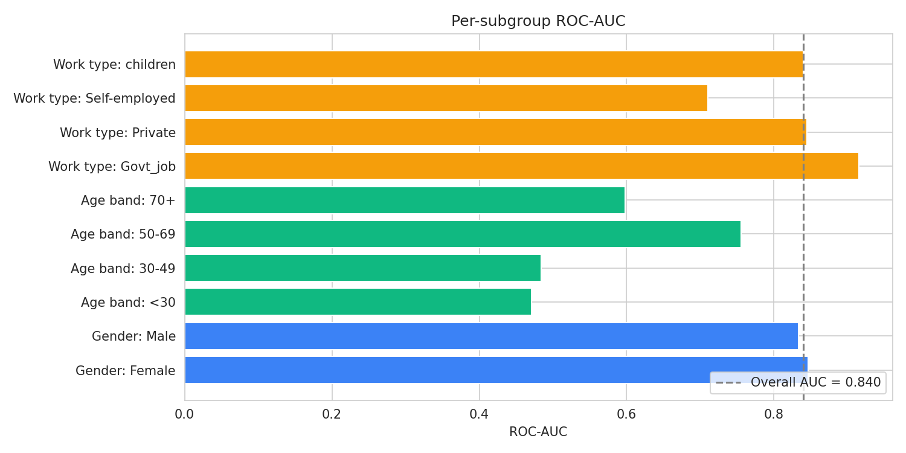
</p>

The model was evaluated across:

- gender groups
- age bands
- work types

This helps assess whether the model performs consistently across demographic subgroups.

---

# Technologies Used

| Category | Tools |
|---|---|
| Programming | Python |
| Data Analysis | Pandas, NumPy |
| Visualization | Matplotlib, Seaborn |
| Machine Learning | Scikit-learn |
| Imbalanced Learning | SMOTE |
| Gradient Boosting | XGBoost |
| Explainability | SHAP |
| Development | Jupyter Notebook |

---

# Installation

## Clone Repository

```bash
git clone https://github.com/monir-007/ml-course-stroke-prediction.git
cd ml-course-stroke-prediction
```

---

## Install Dependencies

```bash
pip install -r requirements.txt
```

---

## Run Notebook

```bash
jupyter notebook
```

Open:

```text
notebook/stroke_prediction.ipynb
```

---

# Key Learning Outcomes

This project demonstrates:

- data preprocessing
- feature engineering
- imbalanced classification handling
- model comparison
- evaluation metrics
- explainable AI (XAI)
- healthcare machine learning workflows

---

# Author

## Md Monir Hossain

GitHub:
https://github.com/monir-007

Project Repository:
https://github.com/monir-007/ml-course-stroke-prediction

---

# License

This project is for final report of ML Course.

